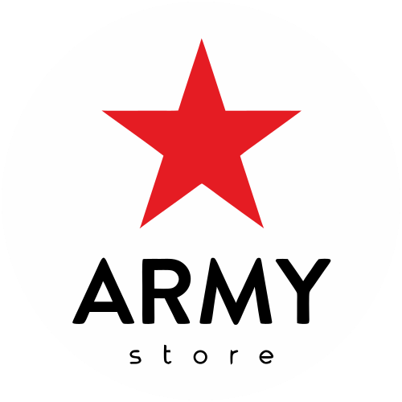

# Army - Productos Tácticos y Militares

<p align="center">
  
</p>

<p align="center">
  
  
  
  
</p>

## Descripción

Army es una aplicación web para la venta de productos tácticos y militares, diseñada para ofrecer equipamiento táctico de alta calidad con años de experiencia en el mercado. La plataforma permite a los clientes explorar productos, ver detalles y contactar a la tienda a través de múltiples canales.

## Características Principales

### 1. Diseño Moderno y Temática Militar
- Interfaz con tema militar utilizando colores tácticos
- Soporte para tema claro/oscuro
- Diseño completamente responsivo para todos los dispositivos

### 2. Tienda Virtual
- Catálogo de productos organizado por categorías
- Productos destacados en la página principal
- Filtrado y búsqueda avanzada de productos

### 3. Gestión de Productos
- Panel de administración para gestionar el inventario
- CRUD completo de productos
- Soporte para variaciones (colores, tallas, materiales)
- Categorías específicas para equipamiento táctico y militar

### 4. Información Corporativa
- Página "Sobre Nosotros" con información de la compañía
- Historia y valores de la empresa
- Misión y visión
- Datos de contacto con integración de:
  - Google Maps para ubicación
  - WhatsApp para comunicación directa
  - Enlaces a redes sociales
  - Horarios de atención

### 5. Navegación Intuitiva
- Cabecera unificada con enlaces principales
- Menú de navegación para móviles
- Perfil de usuario con opciones de inicio de sesión

## Tecnologías Utilizadas

### Frontend
- React
- Material-UI
- Theme-Manager para gestión de temas
- ImageLocal para manejo de imágenes

### Gestión de Datos
- LocalStorage para persistencia temporal
- Funciones de exportación e importación de datos

## Arquitectura de Componentes

El proyecto sigue una arquitectura modular organizada por funcionalidades:

### Componentes Principales
- `head-main.jsx`: Cabecera principal unificada
- `store.jsx`: Vista principal de la tienda

### Componentes de Tienda
- `FeaturedProducts.jsx`: Productos destacados en la página principal
- `ProductCard.jsx`: Tarjeta de visualización de productos
- `ProductGrid.jsx`: Cuadrícula para visualización de múltiples productos
- `PromoBanner.jsx`: Banners promocionales

### Componentes Corporativos
- `about.jsx`: Página "Sobre Nosotros" con información de la empresa

### Componentes Utilitarios
- Componentes reutilizables para iconos y elementos de interfaz
- Gestión de temas (claro/oscuro)
- Contenedores para layouts responsivos

## Estructura del Proyecto

```
Army/
├── public/
│   ├── img/                # Imágenes estáticas (logo, iconos)
│   └── index               # HTML principal
├── src/
│   ├── app/                # Lógica principal
│   │   └── theme/          # Tema y componentes UI
│   │       ├── components/ # Componentes reutilizables
│   │       │   ├── containers   # Contenedores layout
│   │       │   └── templates/   # Plantillas de componentes (cabecera, menús)
│   │       └── identity/   # Identidad visual e identificadores de marca
│   ├── views/              # Componentes de vista
│   │   ├── about/          # Página "Sobre Nosotros"
│   │   ├── panel/          # Panel de administración
│   │   │   └── components/ # Componentes del panel
│   │   └── store/          # Tienda y catálogo
│   │       └── components/ # Componentes de la tienda
│   └── index.js            # Punto de entrada de la aplicación
├── package.json            # Dependencias y scripts
└── README.md               # Este archivo
```

## Instalación

Para instalar y ejecutar Army localmente, sigue estos pasos:

```bash
# Clonar el repositorio
git clone https://github.com/tu-usuario/Army.git

# Navegar al directorio del proyecto
cd Army

# Instalar dependencias
npm install

# Iniciar la aplicación en modo desarrollo
npm start
```

La aplicación estará disponible en [http://localhost:3000](http://localhost:3000).

## Contacto

Army Store
- Dirección: calle 4 # 1-16, Buga, Colombia
- WhatsApp: 317 2853385
- Email: army.storebuga@gmail.com
- Instagram: [@armystore.buga](https://instagram.com/armystore.buga)
- WhatsApp: [Enviar mensaje](https://bit.ly/EnviarMensajeArmyStore)

## Horarios

- Lunes a Viernes: 9:00 AM - 6:00 PM
- Sábados: 9:00 AM - 4:00 PM
- Domingos: Cerrado
